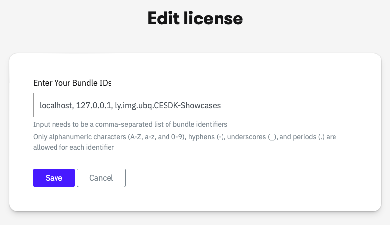

# IMGLY Creative Engine and UI - Swift Examples

This repository contains the Swift examples for the IMG.LY `Engine`, the core of CE.SDK, as well as examples of our mobile editor solutions and mobile camera.
The `Engine` enables you to build any design editing UI, automation and creative workflow in Swift.
It offers performant and robust graphics processing capabilities combining the best of layout, typography and image processing with advanced workflows centered around templating and adaptation. 

The `Engine` seamlessly integrates into any iOS app whether you are building a photo editor, template-based design tool or scalable automation of content creation for your app.
The mobile editor and camera are fully built on top of the `Engine`.

## Documentation

The full documentation of the [engine](https://img.ly/docs/cesdk/engine/quickstart?platform=ios), the [mobile editor](https://img.ly/docs/cesdk/mobile-editor/quickstart?platform=ios), and the [mobile camera](https://img.ly/docs/cesdk/mobile-camera/quickstart?platform=ios) can be found on our website.
There you will learn how to integrate and configure them for your use case.

## License

The `Engine` is a commercial product. To use it you need to unlock the SDK with a license file. You can purchase a license at https://img.ly/pricing.

In order to run the `CESDK-Showcases` application in this repository use the instructions below:
1. Get a free trial license at https://img.ly/forms/free-trial. Note that the license is tied to the bundle identifier of the application. Since the bundle identifier of the `CESK-Showcases` app is `ly.img.ubq.CESDK-Showcases`, you should include it in the list of bundle IDs.
   
2. Copy the license key.
3. Include the license key in the `secrets/Secrets.swift` file:
```
licenseKey: ...
```

Note that failing to provide the license key will display an error when opening any of the showcases.
